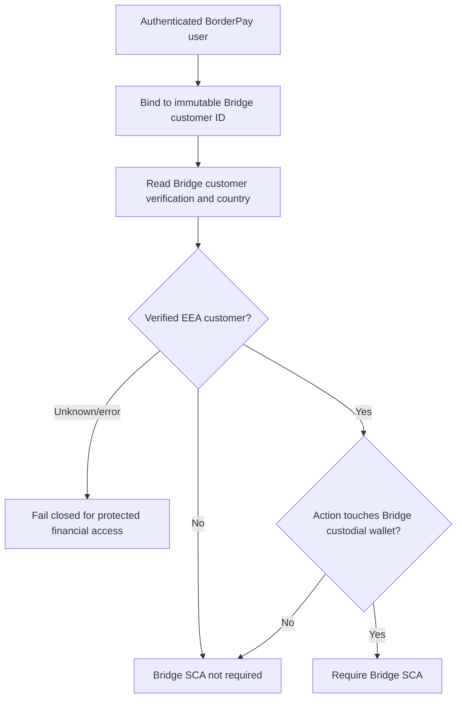
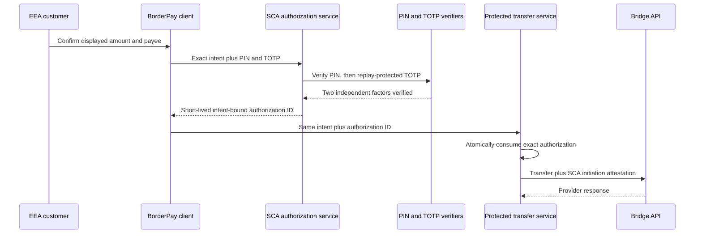

# BorderPay Africa, Inc. - Bridge EEA SCA evidence package

Submission type: Initial QA evidence pack

Prepared: 1 September 2026

Implementation model: Directly implemented multi-factor authentication

Status: READY FOR INITIAL QA - production validation remains disabled until Bridge approval

Authoritative materials reviewed:

- BBSA SCA Requirements and Developer Oversight Process supplied by Bridge;
- SCA Attestation for Bridge Transfers API Requests, August 2026 revision;
- Bridge support clarification that the attestation is one `initiation` object
  with `attestations.sca.outcome`; and
- Bridge's evidence-submission instructions supplied through DocSend.

## 1. Scope and control boundary

Bridge SCA applies only when both conditions are true:

1. the action touches a Bridge custodial wallet; and
2. Bridge's authoritative customer record places the verified individual or business in the EEA.

The EEA scope is EU-27 plus Iceland, Liechtenstein, and Norway. The United Kingdom and Switzerland are excluded. Login is not an SCA-protected action. Fund-in/deposit flows and non-custodial wallets are excluded.

Protected actions are:

- account access: balances, transaction history, and custodial-wallet details;
- funds-out: payment initiation or withdrawal from a Bridge custodial wallet; and
- sensitive remote actions that can affect fund movement: beneficiary, credential, and relevant wallet-setting changes.

The server binds the authenticated BorderPay user to one Bridge customer, reads Bridge's customer country, records the provider-derived scope with a bounded lifetime, and fails closed when an in-scope decision cannot be established. Browser-supplied country values are not authoritative.

Source references:

- `supabase/functions/sca-authorize/index.ts`
- `supabase/functions/_shared/sca.ts`
- `supabase/functions/_shared/bridge-identity-invariant.ts`
- `supabase/migrations/20260826120000_provider_scoped_sca_financial_reads.sql`
- `supabase/migrations/20260826123000_provider_scoped_sca_admin_bypass.sql`
- `supabase/migrations/20260831193000_sca_fail_closed_activation.sql`
- `supabase/migrations/20260901120000_bridge_eea_sca_controlled_activation.sql`

Both the Edge authorization service and database read policies have an
explicit Bridge-EEA rollout control. It defaults off. Activation is blocked
until Bridge approves QA, compatible clients are released, and the
service-role preflight reports zero missing or expired provider scopes.



## 2. Authentication factors and independence

BorderPay uses two factors from different Bridge-accepted categories:

1. Knowledge: a six-digit transaction PIN, verified server-side against the separately stored salted PIN verifier.
2. Possession: RFC 6238 TOTP from an independently enrolled authenticator application, verified server-side with replay protection.

Email OTP, magic links, IP address, device fingerprint, and two knowledge factors are not accepted as the possession factor. The user's normal login is not treated as completion of the Bridge SCA event.

Factor independence:

- The PIN is selected by the customer and is not derived from the TOTP secret.
- The TOTP seed is generated during authenticator enrollment and is not disclosed by possession of the PIN.
- PIN verification completes before TOTP verification, preventing a valid one-time TOTP from being consumed after a wrong PIN.
- A stored TOTP counter prevents replay of an accepted code.
- Neither PIN nor TOTP values enter the authorization payload hash or audit record.

Source references:

- `supabase/functions/sca-authorize/index.ts`
- `supabase/functions/verify-pin/index.ts`
- `supabase/functions/verify-2fa/index.ts`
- `supabase/migrations/20260821170000_universal_sca_authorizations.sql`

## 3. User journey and enforcement points

For an in-scope action, the user sees the exact action context, enters the transaction PIN, and then enters the authenticator code. The server verifies both factors and issues a short-lived, user-bound, operation-bound authorization. The protected Edge Function atomically consumes that authorization before it calls Bridge.

An authorization is never created for a failed factor check. It expires within five minutes and can be consumed only once.



Controlled QA screenshots (each is visibly marked as non-production):

- `artifacts/bridge-sca-evidence/screenshots/01-account-access-pin.png`
- `artifacts/bridge-sca-evidence/screenshots/02-account-access-totp.png`
- `artifacts/bridge-sca-evidence/screenshots/03-payment-context.png`
- `artifacts/bridge-sca-evidence/screenshots/04-factor-enrollment.png`
- `artifacts/bridge-sca-evidence/screenshots/05-non-eea-bypass.png`
- `artifacts/bridge-sca-evidence/screenshots/06-fund-in-excluded.png`

These captures demonstrate the candidate UI and scope behavior without calling
Bridge or moving customer funds. A live or production recording will be made
only in a Bridge-authorized QA window.

## 4. Payment-linked SCA and replay protection

The authorization hash is SHA-256 over a deterministic canonical representation of the operation resource and exact request. The canonical transfer intent includes the amount, destination/payee, source, destination rail, currency, and idempotency key. Credential fields and the authorization ID are excluded.

Changing the amount, payee, operation resource, or idempotency key produces a different hash. The protected transfer function rejects the original authorization and requires a new SCA event. Database consumption is atomic and requires an unexpired, unconsumed authorization whose user, operation, resource, and hash all match.

Source and test references:

- `supabase/functions/_shared/sca.ts`
- `supabase/functions/bridge-transfer/index.ts`
- `supabase/migrations/20260821170000_universal_sca_authorizations.sql`
- `tests/universal-sca.test.ts`

Captured controlled results are indexed in
`artifacts/bridge-sca-evidence/dynamic-linking-test-results.txt`. They prove
that amount, payee, resource and idempotency-key changes produce a different
authorization hash. Atomic database consumption additionally rejects an
expired, consumed or mismatched authorization.

## 5. Bridge transfer attestation

Bridge support corrected the earlier PDF structure. BorderPay will submit one `initiation` object with `channel`, `subchannel`, and nested `attestations.sca.outcome`:

```json
{
  "amount": "10.00",
  "on_behalf_of": "<pseudonymised-customer-id>",
  "source": { "...": "redacted" },
  "destination": { "...": "redacted" },
  "initiation": {
    "channel": "other",
    "subchannel": "remote",
    "attestations": {
      "sca": {
        "outcome": "sca_used"
      }
    }
  }
}
```

For a native mobile initiation, the proposed channel is `other_mobile_payment`; web uses `other`; all current BorderPay Bridge flows use `remote`. BorderPay does not claim an exemption and uses `sca_used` only after successful authorization consumption.

Source references:

- `supabase/functions/_shared/sca.ts`
- `supabase/functions/_shared/providers/types.ts`
- `supabase/functions/bridge-transfer/index.ts`

No production transfer test will be attempted until Bridge authorizes QA.

## 6. Enrollment and recovery

An EEA customer cannot complete an SCA-protected action until both the transaction PIN and authenticator factor are enrolled. Removing or replacing an active authenticator is itself a protected security change. Login remains available, but account access, beneficiary changes, and funds-out remain blocked until the two-factor requirement is restored.

The enrollment capture proves that both factors are required before protected
access. The approved implementation policy is
`docs/BRIDGE_EEA_SCA_RECOVERY_POLICY.md`. Password recovery and active-factor
replacement start a 24-hour server-enforced restriction. Login and fund-in
remain available; account access, beneficiary changes, funds-out and sensitive
credential changes remain blocked.

## 7. Logging, retention, and monitoring

The application records authorization success, authorization failure, consumption, and rejection with a pseudonymous user identifier, operation, resource, payload hash, reason code, and timestamp. It does not write PINs, TOTP codes or seeds, passwords, biometric templates, private keys, or raw transfer payloads into the SCA audit record.

Source references:

- `public.sca_audit_events` in `supabase/migrations/20260821170000_universal_sca_authorizations.sql`
- SCA event writes in `supabase/functions/sca-authorize/index.ts`
- atomic consumption events in `public.consume_sca_authorization`

Credential-free controlled samples are included for:

- successful SCA;
- failed SCA;
- rate-limit/lockout; and
- mismatched or replayed authorization.

The candidate records an explicit `authorization_locked` event after five
failed attempts within fifteen minutes. Unknown or expired provider scope is
not treated as proof of non-EEA residence: protected customer reads and
actions fail closed until a current Bridge-derived scope exists.

The source candidate now exports sanitized SCA audit mutations into BorderPay's hash-chained external-audit delivery ledger. The delivery worker requires independently signed `COMPLIANCE` object-lock receipts covering at least 1,827 days for SCA records.

Source references:

- `supabase/migrations/20260831190000_sca_audit_external_retention.sql`
- `supabase/functions/certification-audit-delivery/index.ts`
- `supabase/functions/_shared/certification-audit.ts`

The tamper-resistance design uses a hash-chained local outbox and an
independently administered append-only sink. The delivery worker accepts a
receipt only when its Ed25519 signature, event identity/hash, `COMPLIANCE`
object-lock mode, and minimum retention of 1,827 days all verify. A real sink
receipt and delivery-health result will be captured during Bridge-authorized
QA; no production receipt is fabricated for this initial submission.

## 8. Monitoring and incident response

Required monitoring coverage:

- repeated failed SCA attempts;
- unusual authentication rates;
- TOTP replay attempts;
- authorization mismatch/replay;
- provider-scope lookup failures; and
- protected-action availability failures.

The `sca-monitoring` worker runs every five minutes, creates deduplicated
alerts, and forwards them through the logged operator-email path. Its policy
and response procedure are documented in
`docs/BRIDGE_EEA_SCA_MONITORING_AND_INCIDENT_RUNBOOK.md`; controlled alert
samples are included with the evidence artifacts.

Bridge reporting obligations recorded for the operating procedure:

- suspected or confirmed SCA incident: notify within 24 hours, detailed report within 72 hours, then weekly updates until closure;
- material SCA change: notify within 10 business days;
- new SCA vendor: notify at least 45 calendar days before go-live; and
- quarterly attestation: within 15 business days after quarter-end.

Named contacts:

- implementation DRI: Mark Ikaba, Founder & CEO, BorderPay Africa, Inc.;
- legal representative for attestations: Mark Ikaba, Founder & CEO;
- SCA incident contact: `markikaba@borderpayafrica.com`; and
- Bridge incident address: `sca-incidents@bridge.xyz`.

## 9. Evidence index and completion gate

| Bridge requirement | Evidence | Status |
|---|---|---|
| EEA/custodial scope | Architecture and source references in section 1 | Ready for review |
| Two independent factors | Independence analysis in section 2 | Ready for review |
| Factor sequence | Controlled QA PIN and TOTP screenshots | Ready for initial QA |
| Dynamic linking | Source and controlled test results | Ready for initial QA |
| Safe enrollment | Controlled screenshot and server enforcement | Ready for initial QA |
| Recovery | 24-hour restriction and assisted-recovery policy | Ready for initial QA |
| Successful/failed/lockout logs | Sanitized controlled samples | Ready for initial QA |
| Five-year tamper-resistant retention | Hash-chain and signed 1,827-day COMPLIANCE receipt enforcement | Source ready; real receipt deferred to Bridge-authorized QA |
| Monitoring | Five-minute worker, alerts, tests and incident runbook | Ready for initial QA |
| Correct transfer attestation | Corrected nested request plus offline test | Ready; production test prohibited pending approval |
| DRI/legal/incident contacts | Named contacts | Ready for initial QA |
| QA access | Controlled captures now; test access/recorded live demo after authorization | Awaiting Bridge QA direction |

This package is complete for Bridge's initial QA review. It deliberately does
not claim production validation. Production test evidence and the real WORM
receipt are follow-up QA artifacts that require Bridge authorization and the
approved test procedure.

## 10. Offline verification

```text
deno test --allow-env tests/universal-sca.test.ts
deno test tests/bridge-sca-monitoring.test.ts
python3 tests/audit/universal_sca_audit.py
python3 tests/audit/bridge_sca_recovery_monitoring_audit.py
python3 tests/audit/bridge_sca_retention_audit.py
deno check --node-modules-dir=auto supabase/functions/_shared/sca.ts
deno check --node-modules-dir=auto supabase/functions/sca-authorize/index.ts
deno check --node-modules-dir=auto supabase/functions/bridge-transfer/index.ts
npm run type-check
git diff --check
```

No production customer, production transfer, or live Bridge SCA test was used
to create this initial QA package.
