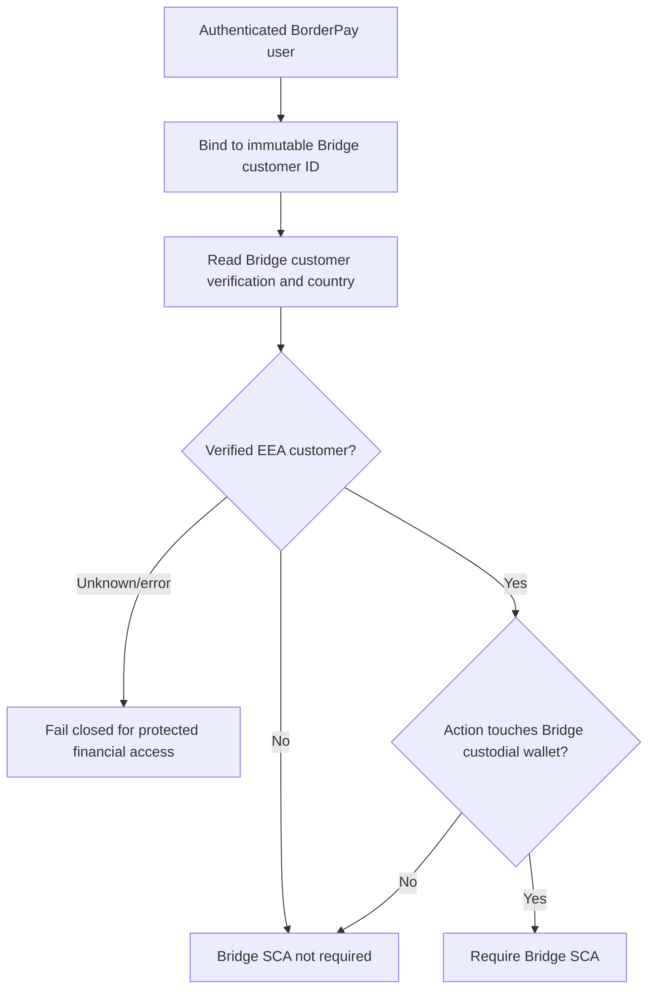
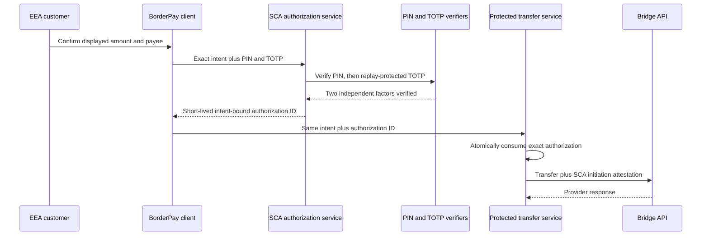

# BorderPay Africa, Inc. - Bridge EEA SCA evidence package

Submission type: Initial QA evidence pack

Prepared: 31 August 2026

Implementation model: Directly implemented multi-factor authentication

Status: DRAFT - evidence capture incomplete; do not submit as final

Authoritative materials reviewed:

- BBSA SCA Requirements and Developer Oversight Process supplied by Bridge;
- SCA Attestation for Bridge Transfers API Requests, August 2026 revision;
- Bridge support clarification that the attestation is one `initiation` object
  with `attestations.sca.outcome`; and
- Bridge's evidence-submission instructions supplied through DocSend.

## 1. Scope and control boundary

Bridge SCA applies only when both conditions are true:

1. the action touches a Bridge custodial wallet; and
2. Bridge's authoritative customer record places the verified individual or business in the EEA.

The EEA scope is EU-27 plus Iceland, Liechtenstein, and Norway. The United Kingdom and Switzerland are excluded. Login is not an SCA-protected action. Fund-in/deposit flows and non-custodial wallets are excluded.

Protected actions are:

- account access: balances, transaction history, and custodial-wallet details;
- funds-out: payment initiation or withdrawal from a Bridge custodial wallet; and
- sensitive remote actions that can affect fund movement: beneficiary, credential, and relevant wallet-setting changes.

The server binds the authenticated BorderPay user to one Bridge customer, reads Bridge's customer country, records the provider-derived scope with a bounded lifetime, and fails closed when an in-scope decision cannot be established. Browser-supplied country values are not authoritative.

Source references:

- `supabase/functions/sca-authorize/index.ts`
- `supabase/functions/_shared/sca.ts`
- `supabase/functions/_shared/bridge-identity-invariant.ts`
- `supabase/migrations/20260826120000_provider_scoped_sca_financial_reads.sql`
- `supabase/migrations/20260826123000_provider_scoped_sca_admin_bypass.sql`
- `supabase/migrations/20260831193000_sca_fail_closed_activation.sql`



## 2. Authentication factors and independence

BorderPay uses two factors from different Bridge-accepted categories:

1. Knowledge: a six-digit transaction PIN, verified server-side against the separately stored salted PIN verifier.
2. Possession: RFC 6238 TOTP from an independently enrolled authenticator application, verified server-side with replay protection.

Email OTP, magic links, IP address, device fingerprint, and two knowledge factors are not accepted as the possession factor. The user's normal login is not treated as completion of the Bridge SCA event.

Factor independence:

- The PIN is selected by the customer and is not derived from the TOTP secret.
- The TOTP seed is generated during authenticator enrollment and is not disclosed by possession of the PIN.
- PIN verification completes before TOTP verification, preventing a valid one-time TOTP from being consumed after a wrong PIN.
- A stored TOTP counter prevents replay of an accepted code.
- Neither PIN nor TOTP values enter the authorization payload hash or audit record.

Source references:

- `supabase/functions/sca-authorize/index.ts`
- `supabase/functions/verify-pin/index.ts`
- `supabase/functions/verify-2fa/index.ts`
- `supabase/migrations/20260821170000_universal_sca_authorizations.sql`

## 3. User journey and enforcement points

For an in-scope action, the user sees the exact action context, enters the transaction PIN, and then enters the authenticator code. The server verifies both factors and issues a short-lived, user-bound, operation-bound authorization. The protected Edge Function atomically consumes that authorization before it calls Bridge.

An authorization is never created for a failed factor check. It expires within five minutes and can be consumed only once.



Required screenshots still to capture in a controlled QA environment:

- `evidence/01-eea-account-access-challenge.png`
- `evidence/02-eea-payment-context-before-sca.png`
- `evidence/03-eea-pin-factor.png`
- `evidence/04-eea-totp-factor.png`
- `evidence/05-non-eea-no-bridge-sca.png`
- `evidence/06-fund-in-no-bridge-sca.png`

## 4. Payment-linked SCA and replay protection

The authorization hash is SHA-256 over a deterministic canonical representation of the operation resource and exact request. The canonical transfer intent includes the amount, destination/payee, source, destination rail, currency, and idempotency key. Credential fields and the authorization ID are excluded.

Changing the amount, payee, operation resource, or idempotency key produces a different hash. The protected transfer function rejects the original authorization and requires a new SCA event. Database consumption is atomic and requires an unexpired, unconsumed authorization whose user, operation, resource, and hash all match.

Source and test references:

- `supabase/functions/_shared/sca.ts`
- `supabase/functions/bridge-transfer/index.ts`
- `supabase/migrations/20260821170000_universal_sca_authorizations.sql`
- `tests/universal-sca.test.ts`

Required evidence still to capture:

- successful exact-intent test result;
- amount-change rejection result;
- payee-change rejection result; and
- replayed-authorization rejection result.

## 5. Bridge transfer attestation

Bridge support corrected the earlier PDF structure. BorderPay will submit one `initiation` object with `channel`, `subchannel`, and nested `attestations.sca.outcome`:

```json
{
  "amount": "10.00",
  "on_behalf_of": "<pseudonymised-customer-id>",
  "source": { "...": "redacted" },
  "destination": { "...": "redacted" },
  "initiation": {
    "channel": "other",
    "subchannel": "remote",
    "attestations": {
      "sca": {
        "outcome": "sca_used"
      }
    }
  }
}
```

For a native mobile initiation, the proposed channel is `other_mobile_payment`; web uses `other`; all current BorderPay Bridge flows use `remote`. BorderPay does not claim an exemption and uses `sca_used` only after successful authorization consumption.

Source references:

- `supabase/functions/_shared/sca.ts`
- `supabase/functions/_shared/providers/types.ts`
- `supabase/functions/bridge-transfer/index.ts`

No production transfer test will be attempted until Bridge authorizes QA.

## 6. Enrollment and recovery

An EEA customer cannot complete an SCA-protected action until both the transaction PIN and authenticator factor are enrolled. Removing or replacing an active authenticator is itself a protected security change. Login remains available, but account access, beneficiary changes, and funds-out remain blocked until the two-factor requirement is restored.

The final submission must include:

- enrollment screenshots proving both factors are required before protected access;
- the written assisted-recovery procedure;
- the factor-replacement cooling/review rule;
- confirmation that financial access and funds-out remain blocked during recovery; and
- a list of all actions restricted during recovery.

Current gap: the repository enforces the two factors for protected actions, but the operational assisted-recovery procedure and its review evidence must be finalized before submission.

## 7. Logging, retention, and monitoring

The application records authorization success, authorization failure, consumption, and rejection with a pseudonymous user identifier, operation, resource, payload hash, reason code, and timestamp. It does not write PINs, TOTP codes or seeds, passwords, biometric templates, private keys, or raw transfer payloads into the SCA audit record.

Source references:

- `public.sca_audit_events` in `supabase/migrations/20260821170000_universal_sca_authorizations.sql`
- SCA event writes in `supabase/functions/sca-authorize/index.ts`
- atomic consumption events in `public.consume_sca_authorization`

The final evidence must include sanitized samples for:

- successful SCA;
- failed SCA;
- rate-limit/lockout; and
- mismatched or replayed authorization.

The candidate records an explicit `authorization_locked` event after five
failed attempts within fifteen minutes. Unknown or expired provider scope is
not treated as proof of non-EEA residence: protected customer reads and
actions fail closed until a current Bridge-derived scope exists.

The source candidate now exports sanitized SCA audit mutations into BorderPay's hash-chained external-audit delivery ledger. The delivery worker requires independently signed `COMPLIANCE` object-lock receipts covering at least 1,827 days for SCA records.

Source references:

- `supabase/migrations/20260831190000_sca_audit_external_retention.sql`
- `supabase/functions/certification-audit-delivery/index.ts`
- `supabase/functions/_shared/certification-audit.ts`

Current blocking gap: source wiring is not proof that the external sink is configured with five-year retention. A real signed sink receipt, pinned public-key fingerprint, retention policy, delivery-health result, and alerting proof must be captured before this package is represented as complete.

## 8. Monitoring and incident response

Required monitoring coverage:

- repeated failed SCA attempts;
- unusual authentication rates;
- TOTP replay attempts;
- authorization mismatch/replay;
- provider-scope lookup failures; and
- protected-action availability failures.

Bridge reporting obligations recorded for the operating procedure:

- suspected or confirmed SCA incident: notify within 24 hours, detailed report within 72 hours, then weekly updates until closure;
- material SCA change: notify within 10 business days;
- new SCA vendor: notify at least 45 calendar days before go-live; and
- quarterly attestation: within 15 business days after quarter-end.

Contacts to confirm before submission:

- implementation DRI: Mark Ikaba, BorderPay Africa, Inc.;
- legal representative for attestations: `[CONFIRM NAME AND TITLE]`;
- SCA incident contact: `[CONFIRM BORDERPAY EMAIL AND PHONE]`; and
- Bridge incident address: `sca-incidents@bridge.xyz`.

## 9. Evidence index and completion gate

| Bridge requirement | Evidence | Status |
|---|---|---|
| EEA/custodial scope | Architecture and source references in section 1 | Ready for review |
| Two independent factors | Independence analysis in section 2 | Ready for review |
| Live factor sequence | Six controlled screenshots | Missing |
| Dynamic linking | Source, tests, and four captured results | Tests ready; captures missing |
| Safe enrollment | Screenshots and enrollment rule | Missing captures |
| Recovery | Approved assisted-recovery procedure | Missing |
| Successful/failed/lockout logs | Sanitized samples | Missing |
| Five-year tamper-resistant retention | Source enforces 1,827-day receipt; real WORM policy and delivery proof | Blocking operational evidence gap |
| Monitoring | Alert definitions and sample alert | Missing |
| Correct transfer attestation | Corrected nested request plus offline test | Ready; production test prohibited pending approval |
| DRI/legal/incident contacts | Named contacts | Partially complete |
| QA access | Test account or recorded demo | Missing |

This package must not be sent as “complete” until every `Missing` or `Blocking gap` row is resolved or Bridge explicitly accepts a documented alternative.

## 10. Offline verification

```text
deno test --allow-env tests/universal-sca.test.ts
python3 tests/audit/universal_sca_audit.py
python3 tests/audit/bridge_sca_retention_audit.py
deno check --node-modules-dir=auto supabase/functions/_shared/sca.ts
deno check --node-modules-dir=auto supabase/functions/sca-authorize/index.ts
deno check --node-modules-dir=auto supabase/functions/bridge-transfer/index.ts
npm run type-check
git diff --check
```

No production customer, production transfer, or live Bridge SCA test is used to create this draft.
