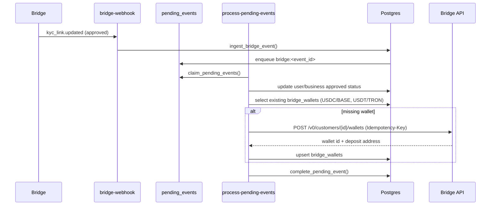

# Phase 2 Financial Correctness Report (Bridge)

Date (UTC): 2026-06-20
Scope: Production behavior validation and runtime correctness hardening for Bridge-only money flows.
Execution constraints honored: no deployment, no production migrations, no permission hardening, no broad cleanup.

## Executive Scores

- Architecture score: **76/100**
- Bridge alignment score: **82/100**
- Financial correctness score: **74/100**
- Production readiness score: **68/100**

## Invariant Summary

- I1 Auto stablecoin wallet provisioning after approved KYC/KYB: **PASS (repo runtime), FAIL (deployed runtime not yet updated)**
- I2 Provisioning idempotency under duplicate webhook deliveries: **PASS**
- I3 Funding gate uses only Bridge stablecoin wallet balances: **PASS (repo runtime), pending deploy evidence**
- I4 Funding gate ignores VA balances and no fabricated 1:1 FX: **PASS**
- I5 Virtual account lifecycle sequencing enforced (approved + funded + destination wallet): **PASS (repo runtime)**
- I6 Bridge webhook category coverage completeness: **PARTIAL FAIL**
- I7 Transfer state mapper preserves raw provider state and maps internal status canonically: **PASS (repo runtime)**
- I8 Runtime-schema contract has no undeployed schema dependency: **PARTIAL FAIL**

## 1) Automatic Stablecoin Wallet Provisioning

Status: **PASS (repo runtime)**

Implemented runtime flow:
1. `process-pending-events` receives `kyc_link.*`, `customer.kyc*`, or `customer.kyb*`.
2. Status projection is updated to approved/rejected/pending.
3. On approved state, worker calls `ensureStablecoinWalletsProvisioned(...)`.
4. Worker checks existing `(bridge_customer_id, currency, chain)` in `bridge_wallets`.
5. Missing default wallets are created via Bridge with deterministic idempotency keys (`borderpay:wallet:<customer>:<symbol>:<chain>`).
6. Wallets are upserted into `bridge_wallets`.
7. Any provisioning failure throws and webhook queue retries safely.

Sequence diagram:

Evidence:
- `process-pending-events` now provisions on both KYC/KYB-approved and customer-active paths.
- Queue retry path remains fail-closed via `fail_pending_event`.

## 2) Funding Gate

Status: **PASS (repo runtime)**

Current behavior:
- Gate computes threshold from Bridge wallet balances only.
- Sources virtual-account balances are removed from gate logic.
- Explicit USD-pegged stablecoins are counted (`USDC`,`USDT`,`USDB`,`PYUSD`).
- Gate supports multiple wallets/chains by iterating all Bridge wallets for the customer.
- No synthetic FX conversion is used.

Thresholds:
- Individual: `$20`
- Business: `$100`

## 3) Virtual Account Lifecycle

Status: **PASS (repo runtime)**

Enforced transitions:
1. Customer profile exists.
2. Bridge customer linked (`bridge_customer_id`).
3. KYC/KYB approved.
4. Stablecoin destination wallet exists (auto-provisioned if missing for VA request path).
5. Funding threshold verified from Bridge stablecoin wallet balances.
6. VA create call sent to Bridge.
7. `bridge_virtual_accounts` projection updated.
8. UI reads projection (`bridge_virtual_accounts`) and renders account.

## 4) Bridge Event Coverage Matrix

Status: **PARTIAL FAIL**

| Bridge category | Runtime status | Notes |
|---|---|---|
| `customer.*` | Handled | status + profile projection |
| `kyc_link.*` | Handled | KYC/KYB path + auto-provision trigger |
| `virtual_account.*` | Handled | lifecycle + activity credit path |
| `bridge_wallet.activity.*` | Handled | routed via `bridge_wallet.*` support |
| `transfer.*` | Handled | canonical state mapping applied |
| `payout.*` | Partially handled | routed to transfer handler; taxonomy not fully locked |
| `deposit.*` | Partially handled | routed to transfer handler; event-shape variance risk |
| `external_account.*` | Missing | no dedicated webhook handler yet |
| `liquidation_address.drain.*` | Ignored intentionally | not in active BorderPay product path |
| `static_memo.activity.*` | Ignored intentionally | not in active BorderPay product path |
| `card_*` categories | Ignored intentionally | cards not launch scope |
| unknown categories | Safely idempotent | completed without side effects |

## 5) Transfer State Machine (Canonical)

Status: **PASS (repo runtime)**

Canonical mapper (`_shared/bridge-transfer-state.ts`):

- Pending/internal pending:
  - `awaiting_funds`
  - `in_review`
  - `funds_received`
  - `payment_submitted`
  - `refund_in_flight`
- Completed/internal completed:
  - `payment_processed`
- Terminal failure/internal failed:
  - `undeliverable`
  - `returned`
  - `missing_return_policy`
  - `refunded`
  - `refund_failed`
  - `canceled`
  - `error`
- Unknown provider states:
  - preserved as `provider_state`
  - internal state defaults to `pending` (fail-safe)

Preservation guarantees:
- raw provider state preserved in `bridge_transfers.state`
- provider state + recognition flag preserved in `transactions.metadata`
- raw payload persisted for reconciliation

## 6) Runtime Contract Validation Matrix

Status: **PARTIAL FAIL**

| Runtime file | Expected schema | Migration in repo | Live production status | PASS/FAIL |
|---|---|---|---|---|
| `process-pending-events` transfer upsert | `bridge_transfers.state,raw` (no reconciliation_* hard dependency) | `20260510_bridge_phase1_first_class_tables.sql` | present | PASS |
| `process-pending-events` VA credits | `bridge_virtual_account_balances`, `apply_bridge_va_credit()` | `20260510_bridge_balance_ledger.sql` | table present | PASS |
| `bridge-transfer` | `transactions.bridge_transfer_id/provider/metadata`, `upsert_bridge_transaction()` | `20260510_bridge_transactions_mirror.sql` | columns present | PASS |
| `bridge-bulk-payout` | same as above | `20260510_bridge_transactions_mirror.sql` | present | PASS |
| `bridge-wallet` + provisioning | `bridge_wallets` | `20260510_bridge_phase1_first_class_tables.sql` | present | PASS |
| `bridge-virtual-account` | `bridge_virtual_accounts` | `20260510_bridge_phase1_first_class_tables.sql` | present | PASS |
| webhook ingest path | `bridge_webhook_events`, `pending_events`, `webhook_logs`, `ingest_bridge_event()` | `20260507_bridge_integration_phase0.sql` + `20260510_bridge_webhook_atomic_ingest.sql` + `20260529_bridge_ingest_event_webhook_logs_parent.sql` | tables + flow present in live schema | PASS |
| queue runtime prerequisites | tracked local migrations through `20260619124500` | local migration history diverges from remote chain (many remote-only versions) | drift exists | FAIL |
| reproducible schema provenance for `pending_events`/`webhook_logs` in repo | explicit table-create migration in checked-in chain | not found in current checked-in migration set | tables exist live but provenance missing locally | FAIL |

## Dead Maplerad/legacy code findings (no removal executed)

- Legacy provider functions remain as deliberate `410 provider_removed` stubs.
- No active Bridge runtime path depends on Maplerad execution.
- Candidate cleanup remains deferred per directive.

## Test Evidence (executed)

- `tests/audit/bridge_ingest_event_audit.py`: PASS
- `tests/audit/bridge_event_envelope_audit.py`: PASS
- `tests/audit/bridge_webhook_signature_audit.py`: PASS
- `tests/audit/webhook_transfer_reconciliation_audit.py`: PASS

## Bridge API Reference Set (validation basis)

- Idempotency model (POST idempotency window + semantics)
- Create wallet endpoint (`POST /customers/{customerID}/wallets`)
- Create virtual account endpoint (`POST /customers/{customerID}/virtual_accounts`)
- Webhook event structure/categories
- Transfer states reference

## Blockers Before TestFlight / Google Play Internal / Public Production

1. Deploy gap: repo fixes are not active in production until controlled deploy.
2. Event coverage gap: `external_account.*` webhook handler remains missing.
3. Schema provenance gap: local migration chain does not fully reproduce current live queue tables history.
4. Drift risk: remote migration history materially diverges from checked-in repo history and needs controlled reconciliation.
5. Bridge doc lock: webhook/event taxonomy should be pinned to a versioned internal mapping artifact and re-audited before launch freeze.

## Final Phase 2 Verdict

- Phase 2 implementation progress in repo: **SUBSTANTIAL PASS with targeted FAILs**
- Production launch readiness (financial correctness): **NOT READY** until blocker set above is closed with deploy-time evidence.
